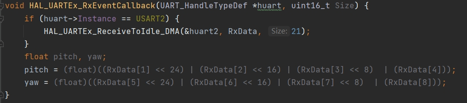
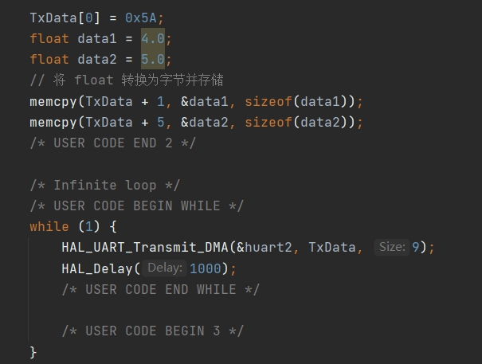

#  视觉与电控的串口通讯模块


该项目改编自[rm_vision](https://github.com/chenjunnn/rm_vision) 的子模块


## 功能包
**auto_aim_interfaces** 消息的接口,类比为结构体形式在节点间通信的媒介
**rm_serial_driver** 串口通讯模块
**example_topic** 示例话题 
## 使用指南

安装依赖 `sudo apt install ros-humble-serial-driver`

更改 `serial_driver.yaml`中的参数以匹配与电控通讯的串口
- baud_rate(波特率)与电控段一致
- device_name 填写正确
  首先插上USB
  ```bash
  ls -l /dev |grep ttyUSB
  ```
  查询串口名字，可能会有驱动问题，复制报错去谷歌搜索解答
打开虚拟串口 `sudo chmod 777 /dev/ttyUSB0`
启动串口模块 `ros2 launch rm_serial_driver serial_driver.launch.py`


## 示例
example_topic 每500ms发布一次话题，话题名字为send_data, 消息类型为auto_aim_interfaces中的SendData.msg，分别为
```cpp
// 创建消息
        auto_aim_interfaces::msg::SendData message;
        message.header.stamp = this->now();
        message.position_x = x;
        message.position_y = y;
        message.pitch = pitch;
        message.yaw = yaw;
        message.shot = shot;
```
实际情况下在自己的代码中添加发布者，发布消息即可
**rm_serial_driver**中订阅上述话题，触发sendData回调函数
```cpp
  send_data_sub_ = this->create_subscription<auto_aim_interfaces::msg::SendData>(
    "send_data", rclcpp::SensorDataQoS(),std::bind(&RMSerialDriver::sendData, this, std::placeholders::_1));
```
```bash
# 查询视觉发送的数据,先进入项目根目录
source install/setup.bash
ros2 topic echo /send_data
```
将数据赋值给packet
```cpp
    SendPacket packet;
    packet.pitch = msg->pitch;
    packet.yaw = msg->yaw;
    packet.position_x = msg->position_x;
    packet.position_y = msg->position_y;
    packet.shot = msg->shot;
```
发送和接受的数据包可在 `rm_serial_driver/packet.hpp` 中找到并修改，注意与电控端对应

以上是发送数据，接收数据可对应修改，在receiveData函数中修改，并发布，名称为`/serial_msg`，类型为`auto_aim_interfaces::msg::ReceiveData`

```bash
# 查询电控发来的数据,先进入项目根目录
source install/setup.bash
ros2 topic echo /serial_msg
```

注：接收电控数据时约定好帧头和数据，通信的数据都是转化为二进制以字节来传输，可使用packet.hpp中的fromVector和toVector函数进行转化

再注意一点，packet中的才是与电控通信内容，auto_aim_interfaces中的接口仅为节点间通信

## 电控端示例
开启UART串口
空闲中断接收数据并做相关解析



将发送数据转化并通过串口发送


